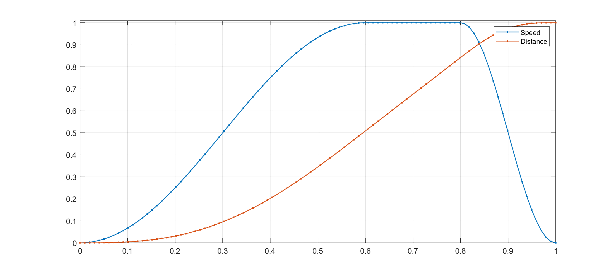
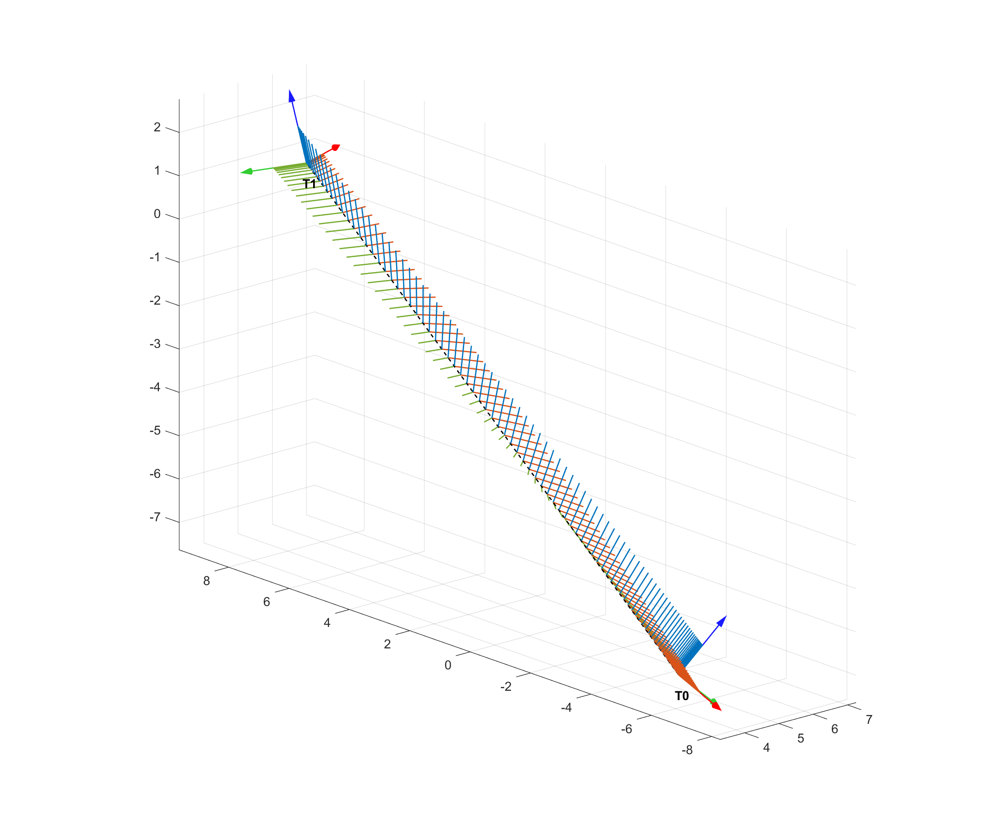

# Interpolate-SE3-se3
 Interpolate homogeneous transformation


Interpolation of 3D location is easy, but how about rotation? 

Obviously Euler Angle does not work. We can use axis angle.

This function allow you to create a trajectory based on 2 pose and 1 path.

```
T_path = interpSE3(T0,T1,s_path,'linear')
T_path = interpSE3(T0,T1,s_path,'screw')
```


**Input**

- T0,T1: Initial, Goal pose
- s_path: path steps, from 0 to 1
- type: linear or screw motion


You can define s_path by your own motion planning algorism.  I defined a simple vcurve function for demo:



Then the interpolation becomes:


